# HyperScaleX
### AI-Powered Product Data Enrichment Pipeline
### Unihack Solution — Team Submission

---

## 1. Problem Statement (as given)

Industrial manufacturers manage vast amounts of product information across websites, catalogs, technical documents, and digital assets. Transforming this fragmented, messy data into accurate, structured, commerce-ready product intelligence is complex and time-consuming.

**Our challenge:** build an AI-powered solution that automates the creation, enrichment, and validation of product intelligence from limited product information — and prove it works against a known-correct ground truth.

---

## 2. The Core Idea (In Simple Words)

There's no pre-built catalogue or master list handed to us. So HyperScaleX's real job is: take one messy row (a part number and a rough description), **go find the truth on the internet**, and turn it into a clean, complete, catalogue-ready record.

We do this with a small **team of AI agents**, not one giant prompt — each agent has one job, its own tool, and hands its result to the next agent. An **Orchestrator** sits in the middle, deciding what happens next for each row (including retrying or digging deeper when something's missing).

---

## 3. Final Tool Stack

| Job | Tool | Why This One |
|---|---|---|
| Web Search | **Tavily (Free Tier)** | Purpose-built for AI agents — returns clean, structured search results instead of raw HTML links, 1,000 free searches/month |
| Web Scraping | **Firecrawl (Free Tier)** | Turns any URL straight into clean, LLM-ready Markdown/JSON — no separate HTML-parsing code needed, 1,000 free credits/month |
| LLM Reasoning | **Groq (Free Tier, Llama 3.3 70B)** | Very high free daily request volume (14,400 requests/day), fast responses — good fit for an agent pipeline that needs many LLM calls per row |
| Orchestration Framework | **LangGraph** | Built for exactly our kind of pipeline — agents as nodes, with loops and conditional branches (retry search, dig deeper) |
| Data Validation | **Pydantic** | Forces every agent's output into a strict, checkable shape before passing it to the next agent |
| Local Cache | **SQLite** | Stores every search/scrape result so we never spend free-tier quota re-fetching the same product twice |

**Why free tiers are enough for now:** we cache aggressively (never search or scrape the same product twice) and test on a small sample (10–20 rows) before running the full dataset — this stretches Tavily's and Firecrawl's free monthly quota much further than it looks on paper.

---

## 4. System Design — The Full Agent Architecture

### 4.1 High-Level Agent Flowchart

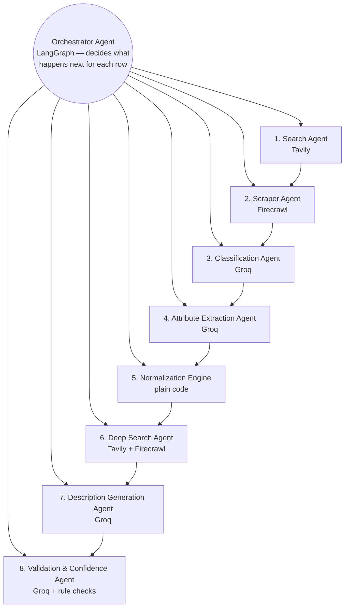

**In plain words:** the Orchestrator is the manager. It never does the actual work — it just looks at where a row currently is (has a page been found? are attributes still missing?) and tells the right agent to run. Every other box is a specialist that does exactly one job using exactly one tool, then reports back.

---

### 4.2 Agent-by-Agent Design (Each With Its Own Mini Flowchart)

---

#### Agent 1 — Search Agent (Tavily)
**Job in one line:** find the manufacturer's real product page on the web.

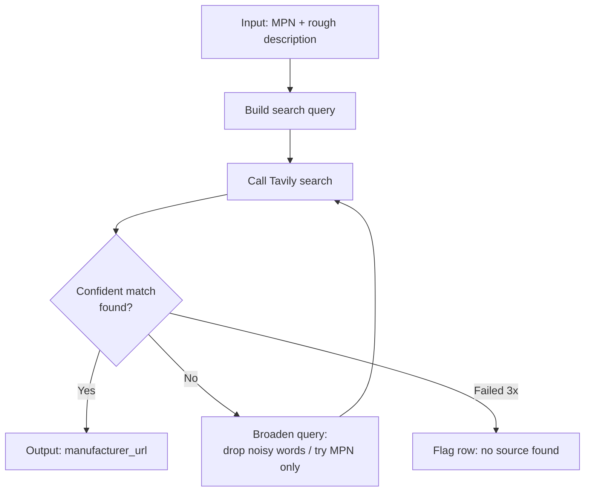

**Simple explanation:** it asks Tavily "where does this part number/description live on the web," prefers the manufacturer's own domain over marketplaces (which are excluded), and if the first search doesn't land a confident answer, it tries a simpler version of the query — up to 3 tries — before giving up and flagging the row.

---

#### Agent 2 — Scraper Agent (Firecrawl)
**Job in one line:** turn that URL into clean, usable content.

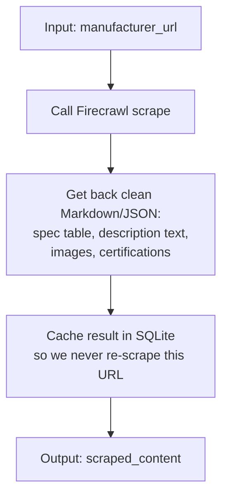

**Simple explanation:** Firecrawl does the hard part for us — no writing our own HTML parser, no headless browser to manage. It hands back a clean structured object we can read directly. We save it locally right away so if any later step needs it again, we don't spend another Firecrawl credit.

---

#### Agent 3 — Classification Agent (Groq)
**Job in one line:** decide the product's category.

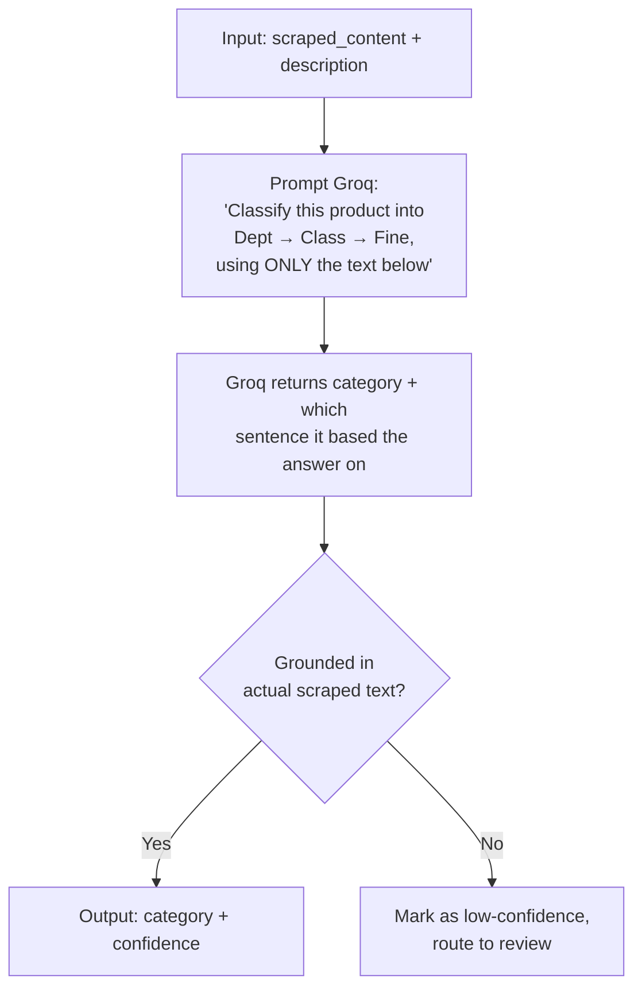

**Simple explanation:** it can only classify using words that actually came from the scraped page — not guess from the model's general knowledge. If it can't point to the exact sentence that justifies its answer, we don't trust it, and it goes to review instead.

---

#### Agent 4 — Attribute Extraction Agent (Groq)
**Job in one line:** pull out the actual specs (size, material, voltage, etc.).

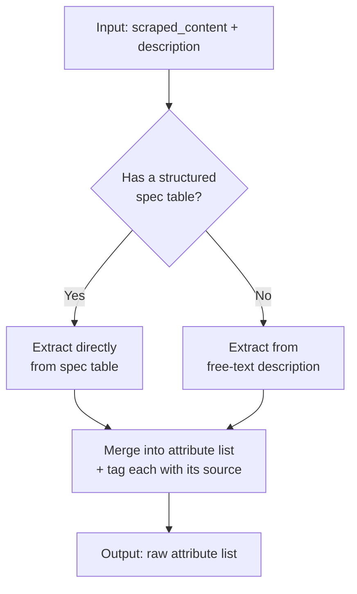

**Simple explanation:** if the manufacturer page has an actual spec table, we trust that over parsing sentences — tables are more reliable. Everything gets tagged with where it came from, which matters later for confidence scoring.

---

#### Agent 5 — Normalization Engine (plain code, not an LLM)
**Job in one line:** clean up units and formatting.

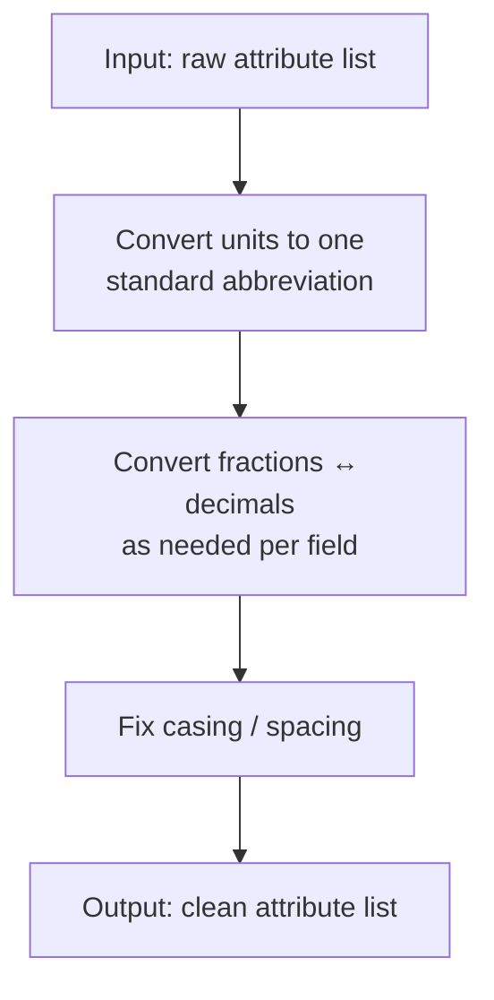

**Simple explanation:** this is just rules, not reasoning — "24IN" always becomes "24 in," a fraction always converts the same way. No LLM call needed here, which makes this step free, instant, and 100% consistent every time.

---

#### Agent 6 — Deep Search Agent (Tavily + Firecrawl)
**Job in one line:** hunt harder for anything still missing.

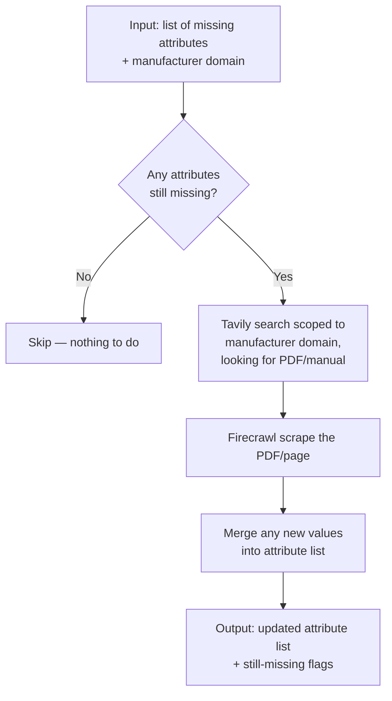

**Simple explanation:** only runs if something's actually missing after the normal pass — no wasted API calls otherwise. It searches specifically for spec sheets/manuals on the manufacturer's own site (not the open web), since that's the most likely place to find the missing detail.

---

#### Agent 7 — Description Generation Agent (Groq)
**Job in one line:** write the 5 required catalogue description formats.

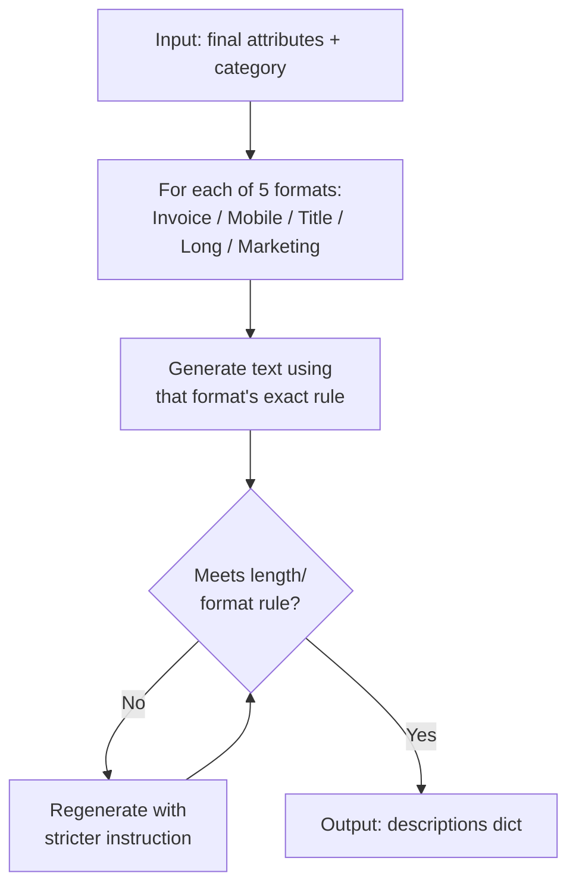

**Simple explanation:** each format has its own hard rule (e.g., Invoice Desc ≤40 characters, ALL CAPS). We don't just trust the LLM to follow the rule — we check it in code afterward, and if it fails, we ask again with a stricter instruction.

---

#### Agent 8 — Validation & Confidence Agent (Groq + rule checks)
**Job in one line:** score how trustworthy the final record is and flag what needs a human.

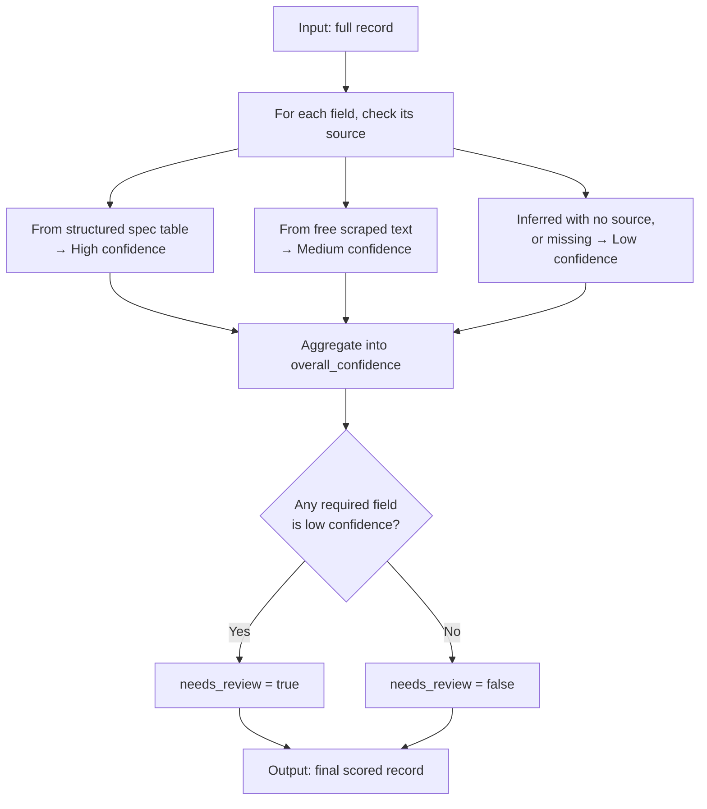

**Simple explanation:** nothing gets silently trusted. Every field's confidence depends on exactly where it came from, and if anything important is shaky, the whole row gets flagged for a human to check instead of shipping a possibly-wrong record.

---

## 5. Full Pipeline Flow — Sequence View

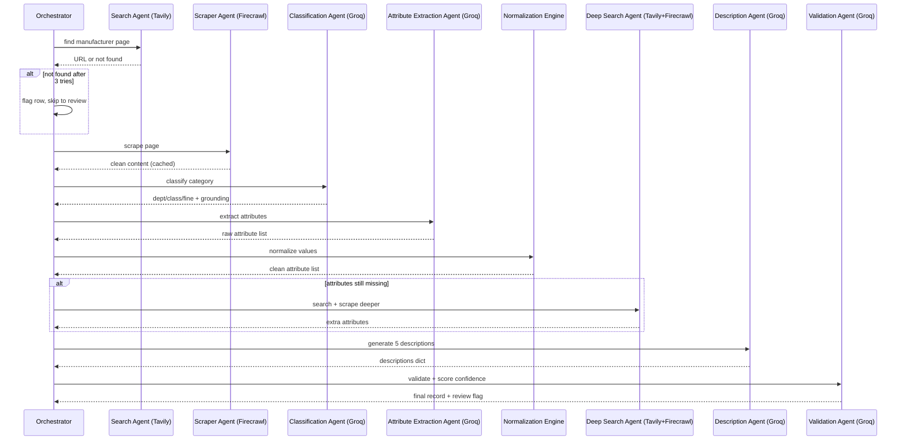

---

## 6. Caching Layer (Why We Don't Burn Through Free Tiers)

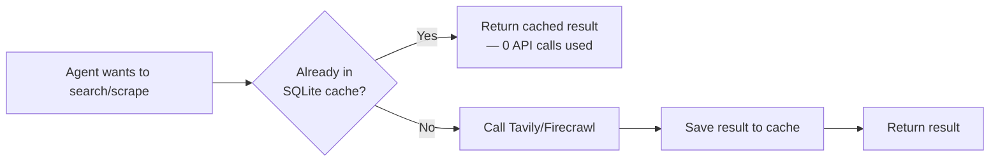

**Simple explanation:** before any agent spends a Tavily search or a Firecrawl scrape, it checks if we've already fetched that exact thing before. If yes, we reuse it for free. This is what makes a 1,000-credit free tier stretch across dev, testing, and demo runs instead of running out on day one.

---

## 7. Shared Data Object (What Flows Between Every Agent)

```python
class RowState(BaseModel):
    row_id: str
    raw_input: dict                 # original MPN, description, brand fields
    manufacturer_url: str | None
    scraped_content: dict | None    # spec_table, text, images, certs
    category: dict | None           # {dept, class, fine, confidence}
    attributes: list[dict]          # each: {name, value, unit, source, confidence}
    missing_attributes: list[str]
    descriptions: dict              # 5 generated formats
    overall_confidence: float
    needs_review: bool
    review_reason: str | None
```

Every agent reads what it needs from this object and writes its own piece back — this is what LangGraph tracks as the row moves through the graph.

---

## 8. Evaluation Plan (What We Show Judges)

- **Field-level accuracy** — compare final output to ground truth, field by field.
- **Source-found rate** — % of rows where the Search Agent located the real manufacturer page.
- **Attribute completeness** — % of expected attributes actually recovered via scrape/deep-search.
- **Agent-level accuracy** — since each agent is independently testable, we can show per-agent numbers (e.g., "Classification Agent: 91% correct on the labeled set"), not just one end-to-end score.
- **API usage efficiency** — cache hit rate, to show the free-tier stack is actually sustainable at demo scale.

---

## 9. Scope for This Build

- **One fully worked category:** Kitchen & Bath Sink Faucets, so search/scrape/classification behavior can be tuned and validated on a narrow, well-understood product type before generalizing.
- **Full agent pipeline** run on that category, evaluated against the matching ground-truth rows.

---

## 10. Summary

HyperScaleX is a team of 8 specialist agents, coordinated by a LangGraph Orchestrator, built entirely on free-tier tools: **Tavily** to find the real manufacturer source, **Firecrawl** to turn it into clean data, and **Groq** to reason over it — with a local cache so those free tiers actually last through development and the demo. Every field in the final record carries its source and confidence, so nothing is silently guessed, and anything shaky gets flagged for a human instead of shipped as fact.
