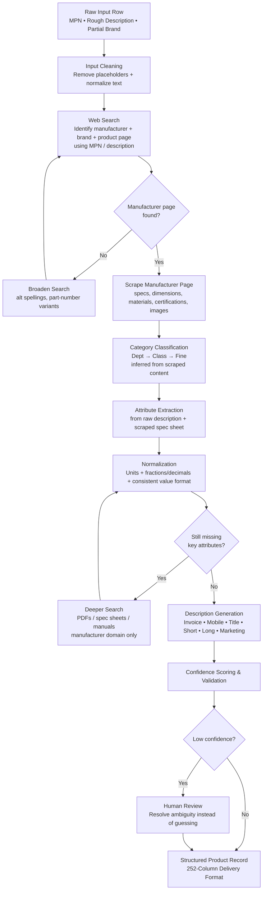

# HyperScaleX
### AI-Powered Product Data Enrichment Pipeline
### Unihack Solution — Team Submission

---

## 1. Problem Statement (as given)

Industrial manufacturers manage vast amounts of product information across websites, catalogs, technical documents, and digital assets. Transforming this fragmented, messy data into accurate, structured, commerce-ready product intelligence is complex and time-consuming.

**Our challenge:** build an AI-powered solution that automates the creation, enrichment, and validation of product intelligence from limited product information — and prove it works against a known-correct ground truth.

---

## 2. An Important Correction to Our Assumption

Our earlier draft assumed we'd be matching against a **pre-built master catalogue** — a ready-made brand list, taxonomy tree, and LOV/attribute list — and just snapping input values onto it.

**That master catalogue does not actually exist as a given resource.** Nobody hands us a clean brand database or a finished taxonomy file. So the real problem isn't "match messy input to a clean list" — it's **"go find the correct information from scratch and build the clean record ourselves."**

That changes the core mechanism of the pipeline: instead of static list-matching, HyperScaleX has to actively **search the web and the manufacturer's own site** for each product to pull in the brand, category, specs, and any missing details — then structure whatever it finds into the record.

---

## 3. What HyperScaleX Is

HyperScaleX takes **one raw, messy product row** — often just a part number and a rough description — and turns it into a **complete, standardized, catalogue-ready product record**, by:

1. Cleaning what little input exists.
2. **Searching the web / manufacturer's official site** to identify the correct brand, manufacturer, and product category (since there's no pre-built list to match against).
3. **Scraping the manufacturer's product page or spec sheet** to pull in attributes, dimensions, materials, and certifications that aren't in the raw input.
4. Normalizing everything found into consistent units/format.
5. Generating the catalogue description formats from the now-complete data.

The web search/scrape step isn't a fallback anymore — it's the core engine of the whole pipeline, because it's our only real source of truth.

---

## 4. System Architecture

### Flowchart

**Reading the diagram:** search and scrape now sit at the center of the pipeline, not at the edges. Everything downstream — classification, attributes, descriptions — depends on what gets found on the manufacturer's own site, so the search step has a retry loop, and the attribute step has a "go deeper" loop into spec sheets/PDFs when the first pass isn't enough.

---

## 5. Pipeline Steps (Detailed)

### 5.1 Input Cleaning
- Recognize and strip placeholder values: `-- Unbranded --`, `-- No Unilog Brand --`, `-- No DIB Brand --` → treat as null, not as data.
- Normalize whitespace, casing, and stray punctuation in the raw description before any search runs.

### 5.2 Web Search — Manufacturer & Product Identification
- Query the web using the part number (MPN) and/or description to locate the manufacturer's official product page.
- Prioritize the manufacturer's own domain over distributor/marketplace results (marketplaces are explicitly excluded as sources per the content guidelines).
- If the first query doesn't resolve a confident match, broaden with alternate spellings or partial part-number matches before giving up on a row.

### 5.3 Scrape Manufacturer Page
- Pull structured and unstructured content from the identified product page: title, spec table, description text, images, certifications.
- This is the primary source of truth for everything the raw input didn't already contain.

### 5.4 Category Classification
- Infer `Dept > Class > Fine` from the scraped page content and product description — since no fixed taxonomy file is given, this is LLM-driven classification grounded in what was actually found on the page, not a lookup.
- Start narrow: build and validate this against two categories (**Faucets**, **Fittings**) before generalizing.

### 5.5 Attribute Extraction
- Parse both the raw description and the scraped spec sheet for size, material, voltage, mounting type, etc.
- Where the manufacturer page has a structured spec table, prefer that over free-text parsing.

### 5.6 Normalization
- **Units:** convert every unit reference to a single consistent abbreviation, always with a space between number and unit (`24 in`, not `24IN`).
- **Fractions/decimals:** convert consistently between the two forms as required by field type.
- If an attribute still can't be found after search + scrape, it's left blank and flagged — not guessed.

### 5.7 Deeper Search (when needed)
- For attributes still missing after the first scrape pass, search specifically for the manufacturer's spec sheet or manual (PDF), scoped to the manufacturer's own domain.

### 5.8 Description Generation
Generate all five required formats for each record:

| Format | Rule |
|---|---|
| Invoice Desc | ≤40 characters, ALL CAPS |
| Mobile Desc | 60–80 characters |
| Product Title / Short Desc | Brand + Series + MPN + Item Type + key attributes |
| Long Description | Full spec-style paragraph, all key attributes, units normalized |
| Marketing Description | Where source content supports it |

### 5.9 Confidence Scoring & Human-Review Flagging
- Every generated field carries a confidence indicator, weighted by how directly it traces back to a scraped manufacturer source vs. inferred/interpreted.
- Low-confidence fields (no product page found, ambiguous classification, missing spec data) are flagged `needs human review` rather than silently filled — explicitly called out in the brief as a strength, not a gap.

---

## 6. Evaluation Plan (What We Show Judges)

- **Field-level accuracy** — run the pipeline on the ground-truth input rows, compare output to the expected record field by field, report % match.
- **Source-found rate** — % of rows where the manufacturer's official product page was successfully located.
- **Attribute completeness** — % of expected attributes actually recovered via search/scrape vs. left blank.
- **Character-limit compliance** — % of generated descriptions within their format's character limit.

---

## 7. Scope for This Build

- **One fully worked category:** Kitchen & Bath Sink Faucets, so search/scrape behavior can be tuned and validated on a narrow, well-understood product type before generalizing.
- **Full pipeline** run on that category, evaluated against the matching ground-truth rows.

---

## 8. Summary

There's no pre-built catalogue to lean on — so HyperScaleX's real job is finding the truth, not just formatting it. The pipeline searches the web to locate each product's official manufacturer page, scrapes it for the real specs, and only then normalizes and formats everything into a clean catalogue record — flagging anything it couldn't verify rather than guessing.
