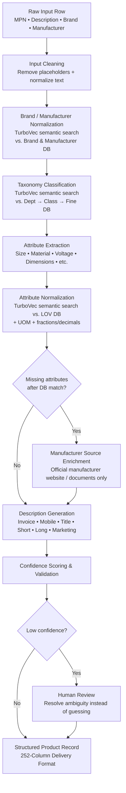

# HyperScaleX
### AI-Powered Product Intelligence Pipeline for Industrial Commerce
### Unihack Solution — Team Submission

---

## 1. Problem Statement (as given)

Industrial manufacturers manage vast amounts of product information across websites, catalogs, technical documents, and digital assets. Transforming this fragmented, messy data into accurate, structured, commerce-ready product intelligence is complex and time-consuming.

**Our challenge:** build an AI-powered solution that automates the creation, enrichment, and validation of product intelligence from limited product information — and prove it works against a known-correct ground truth.

---

## 2. What HyperScaleX Is

HyperScaleX is a **single, unified enrichment pipeline** that takes one raw, messy product row and produces a complete, standardized, rule-compliant catalogue record — classification, brand normalization, attribute extraction, unit/format cleansing, and multi-format description generation.

The key differentiator: instead of relying on plain fuzzy/string matching against master lists, every database lookup step in the pipeline (brand matching, taxonomy classification, LOV attribute snapping) is powered by **TurboVec**, our semantic vector search engine. This means the pipeline can correctly match a messy, misspelled, or oddly-worded input against the right master record even when there's no exact string match — which is where rule-based/fuzzy approaches typically break down.

We deliberately kept this to one tight layer. An earlier draft of this solution split things into a second "assurance" layer with a separate change-monitoring engine — we cut that. It didn't map to anything the brief actually asks for, and it diluted focus away from the core deliverable: producing accurate, ground-truth-verifiable product intelligence from limited input.

---

## 3. System Architecture

### Flowchart

**Reading the diagram:** it's one straight pipeline, raw row to finished record. TurboVec doesn't sit off to the side as a separate feature — it's the engine doing the actual database lookup at every matching step (brand, taxonomy, LOV attributes), so those steps are semantic instead of purely string-based.

---

## 4. Pipeline Steps (Detailed)

This is the part that is directly measured against the ground truth, so it's described field by field.

### 4.1 Input Cleaning
- Recognize and strip placeholder values: `-- Unbranded --`, `-- No Unilog Brand --`, `-- No DIB Brand --` → treat as null, not as data.
- Normalize whitespace, casing, and stray punctuation in the raw description before any extraction runs.

### 4.2 Brand / Manufacturer Normalization (TurboVec-powered)
- Instead of plain fuzzy string matching, the raw `Part_Manuf` / brand string is embedded and matched via **TurboVec semantic search** against a vector index built over `UniCat_Manufacturer_and_Brand_List.xlsx`.
- This catches semantic/typo variants that string-distance matching misses (e.g., abbreviations, reordered words, minor misspellings).
- Output the manufacturer's exact legal name and paired brand, with correct casing, suffixes (Inc/LLC/Ltd), and ® / ™ symbols as listed.
- If no brand is present, the manufacturer name is used in its place (per the rulebook).

### 4.3 Taxonomy & Classification (TurboVec-powered)
- The cleaned description is embedded and matched via TurboVec against a vector index of the `Dept > Class > Fine` category structure from the LOV file, rather than keyword rules alone.
- Start narrow: build and validate this against the two fully-specified categories (**Faucets**, **Fittings**) before generalizing to the rest of the catalog.

### 4.4 Attribute Extraction
- Parse the free-text description for size, material, voltage, mounting type, etc. (e.g., `5"x.045"x7/8"` → Diameter, Thickness, Arbor Size).
- Only extract attributes that are valid for the assigned classpath, per the LOV.

### 4.5 Normalization (TurboVec-powered LOV snapping)
- **Units:** convert every unit reference to the single approved abbreviation from the UOM Standards sheet, always with a space between number and unit (`24 in`, not `24IN`).
- **Fractions/decimals:** use the Decimal_Fraction lookup to convert between the two forms as required by field type.
- **Attribute values:** each extracted value is matched via TurboVec against the allowed LOV values for that attribute — if no confident semantic match exists above threshold, the field is left blank and flagged rather than guessed.

### 4.6 Enrichment from Manufacturer Sources
- Where fields remain empty after extraction and DB matching (dimensions, certifications, images, etc.), retrieve from the manufacturer's own website or published documentation only.
- Marketplaces and distributor sites are explicitly excluded as sources, per the content guidelines.

### 4.7 Description Generation
Generate all five required formats for each record, each with its own formula and constraint:

| Format | Rule |
|---|---|
| Invoice Desc | ≤40 characters, ALL CAPS |
| Mobile Desc | 60–80 characters |
| Product Title / Short Desc | Brand + Series + MPN + Item Type + key attributes |
| Long Description | Full spec-style paragraph, all key attributes, units normalized |
| Marketing Description | Where source content supports it |

### 4.8 Confidence Scoring & Human-Review Flagging
- Every generated field carries a confidence indicator (informed partly by the TurboVec match score at the relevant matching step).
- Low-confidence fields (ambiguous classification, no strong LOV match, missing source data) are flagged `needs human review` rather than silently filled — this is explicitly called out in the brief as a strength, not a gap.

---

## 5. Why We Dropped the Second Layer

An earlier version of this solution proposed a separate "Product Assurance Engine" — a standalone system to periodically re-check manufacturer sources for drift after enrichment was done. We removed it after team review because:

- It doesn't map to anything in the brief's actual scope — the challenge asks for enrichment and validation of the initial record, not ongoing post-hoc monitoring.
- It added a second system, a second set of workflows (Alert Center, Accept/Dismiss actions), and a second thing to evaluate — all pulling focus away from getting the core pipeline right.
- Keeping to one tight, well-evaluated pipeline is a stronger, more defensible hackathon submission than a broader system with a weaker core.

TurboVec survives, but only in its original, narrowly-useful role: it's the semantic search index the pipeline itself queries whenever it needs to match a messy input string against a clean master database (brand, taxonomy, LOV values). It is not a separate buyer-facing search feature in this build.

---

## 6. Evaluation Plan (What We Show Judges)

Following the brief's explicit guidance: *"show your evaluation."*

- **Field-level accuracy** — run the pipeline on the 200-item Input sheet, compare output to the Delivery Format sheet field by field, report % match.
- **TurboVec match quality** — for brand, taxonomy, and LOV-snapping steps, report % of fields where the semantic match was correct vs. a plain fuzzy-string baseline, to show the concrete lift TurboVec gives over string matching.
- **LOV compliance** — % of generated attribute values that are found in the approved LOV list (zero invented values is the target).
- **Character-limit compliance** — % of generated descriptions within their format's character limit.
- **Coverage** — % of the 1,000-item file successfully classified and enriched at scale.

---

## 7. Scope for This Build

Per the brief's guidance that "depth beats breadth," we scope the working demo to:

- **One fully worked category:** Kitchen & Bath Sink Faucets (using `FAUCETS_LOV.xlsx`, which is specified end-to-end).
- **Full pipeline** for that category, evaluated against the matching rows in the 200-item ground truth.
- **TurboVec indexes built** over the Brand/Manufacturer list, the Dept > Class > Fine taxonomy, and the Faucets LOV — so the semantic-matching lift is demonstrable on real data, not just described.

---

## 8. Tech Stack

| Layer | Choice | Why |
|---|---|---|
| Orchestration | Python (pipeline script / lightweight task runner) | Simple, sequential 8-step pipeline — no need for a heavyweight workflow engine at this scale |
| LLM (extraction & description generation) | Claude (Anthropic API) | Strong instruction-following for constrained extraction + format-specific description generation |
| Semantic search / vector matching | TurboVec — embedding model (e.g., `text-embedding-3-small`-class model) + vector index (FAISS / pgvector) | Powers brand, taxonomy, and LOV matching steps against master databases |
| Fuzzy fallback matching | RapidFuzz / Levenshtein | Secondary check where embedding match score falls below confidence threshold |
| Data handling | Pandas | Reading/writing the Input, Delivery Format, and LOV Excel sheets |
| Structured output validation | Pydantic (schema) | Enforce the 252-column Delivery Format schema and field-level types before final output |
| Storage (master data) | SQLite / Postgres (lightweight) | Holds Brand/Manufacturer list, taxonomy tree, and LOV tables that TurboVec indexes against |
| Demo interface | Streamlit | Quick UI to run a record through the pipeline live and show confidence flags to judges |

---

## 9. Why This Is Now Aligned

| Brief's Expected Outcome | How HyperScaleX Delivers It |
|---|---|
| Generate structured product intelligence from limited inputs | Pipeline Steps 1–5 |
| Improve product data quality and consistency | Normalization steps (units, brands, LOV-constrained attributes), all backed by TurboVec semantic matching |
| Validate and enrich information with traceable outputs | Step 6 (manufacturer-only sourcing) + Step 8 confidence flagging |
| Scale efficiently across large product catalogs | Pipeline run across the 1,000-item file + TurboVec indexes scale to the full master lists without per-row rule maintenance |

---

## 10. Summary

HyperScaleX is one tight, well-evaluated pipeline: raw row in, ground-truth-verifiable structured record out. The differentiator isn't a bolt-on second system — it's that every database lookup inside the pipeline (brand, taxonomy, LOV attributes) runs through TurboVec's semantic search instead of plain string matching, which is what makes the core deliverable more accurate on messy real-world input. That's the thing we can actually demo and prove against the ground truth.

