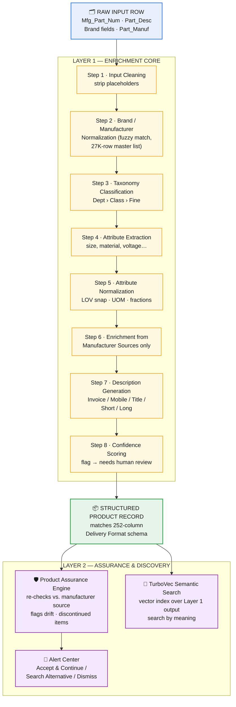

# HyperScaleX
### AI-Powered Product Intelligence Pipeline for Industrial Commerce
### Unihack Solution — Team Submission

---

## 1. Problem Statement (as given)

Industrial manufacturers manage vast amounts of product information across websites, catalogs, technical documents, and digital assets. Transforming this fragmented, messy data into accurate, structured, commerce-ready product intelligence is complex and time-consuming.

**Our challenge:** build an AI-powered solution that automates the creation, enrichment, and validation of product intelligence from limited product information — and prove it works against a known-correct ground truth.

---

## 2. What HyperScaleX Is

HyperScaleX is a two-layer system:

- **Layer 1 — Enrichment Core:** takes one raw, messy product row and produces a complete, standardized, rule-compliant catalogue record (classification, brand normalization, attribute extraction, unit/format cleansing, and multi-format description generation).
- **Layer 2 — Assurance & Discovery:** once records are enriched, keeps them accurate over time (Product Assurance Engine) and makes them easy to find (TurboVec semantic search) — so the value of Layer 1 doesn't decay and doesn't get buried behind bad search.

Layer 1 is the deliverable that gets scored against the ground truth. Layer 2 is what makes the output usable and durable in production — the part that separates a one-time script from an actual product.

---

## 3. System Architecture

> Click/expand in any Mermaid-enabled viewer (GitHub, GitLab, Obsidian, VS Code) — each node maps 1:1 to the pipeline steps detailed in Section 4 and 5.

**Reading the diagram:** the raw row enters Layer 1's eight-step chain top to bottom; only after Step 8's confidence gate does a record become "structured" and flow into Layer 2, where PAE watches it over time and TurboVec makes it searchable. Layer 2 never touches a record that hasn't passed through the full Layer 1 chain.

---

## 4. Layer 1 — Enrichment Core (Detailed)

This is the part that is directly measured against the ground truth, so it's described field by field.

### 4.1 Input Cleaning
- Recognize and strip placeholder values: `-- Unbranded --`, `-- No Unilog Brand --`, `-- No DIB Brand --` → treat as null, not as data.
- Normalize whitespace, casing, and stray punctuation in the raw description before any extraction runs.

### 4.2 Brand / Manufacturer Normalization
- Fuzzy-match the raw `Part_Manuf` / brand string against `UniCat_Manufacturer_and_Brand_List.xlsx`.
- Output the manufacturer's exact legal name and paired brand, with correct casing, suffixes (Inc/LLC/Ltd), and ® / ™ symbols as listed.
- If no brand is present, the manufacturer name is used in its place (per the rulebook).

### 4.3 Taxonomy & Classification
- Assign a `Dept > Class > Fine` classpath using the description text and category structure defined in the LOV file.
- Start narrow: build and validate this against the two fully-specified categories (**Faucets**, **Fittings**) before generalizing to the rest of the catalog.

### 4.4 Attribute Extraction
- Parse the free-text description for size, material, voltage, mounting type, etc. (e.g., `5"x.045"x7/8"` → Diameter, Thickness, Arbor Size).
- Only extract attributes that are valid for the assigned classpath, per the LOV.

### 4.5 Normalization
- **Units:** convert every unit reference to the single approved abbreviation from the UOM Standards sheet, always with a space between number and unit (`24 in`, not `24IN`).
- **Fractions/decimals:** use the Decimal_Fraction lookup to convert between the two forms as required by field type.
- **Attribute values:** snap extracted values to the nearest allowed LOV value — if no confident match exists, the field is left blank and flagged rather than guessed.

### 4.6 Enrichment from Manufacturer Sources
- Where fields remain empty after extraction (dimensions, certifications, images, etc.), retrieve from the manufacturer's own website or published documentation only.
- Marketplaces and distributor sites are explicitly excluded as sources, per the content guidelines.

### 4.7 Description Generation
Generate all five required formats for each record, each with its own formula and constraint:
| Format | Rule |
|---|---|
| Invoice Desc | ≤40 characters, ALL CAPS |
| Mobile Desc | 60–80 characters |
| Product Title / Short Desc | Brand + Series + MPN + Item Type + key attributes |
| Long Description | Full spec-style paragraph, all key attributes, units normalized |
| Marketing Description | Where source content supports it |

### 4.8 Confidence Scoring & Human-Review Flagging
- Every generated field carries a confidence indicator.
- Low-confidence fields (ambiguous classification, no LOV match, missing source data) are flagged `needs human review` rather than silently filled — this is explicitly called out in the brief as a strength, not a gap.

---

## 5. Layer 2 — Assurance & Discovery (Our Original Contribution)

This is where our original HyperScaleX ideas live — now correctly positioned as an enhancement layer sitting **on top of** real enriched data, rather than a substitute for producing it.

### 5.1 Product Assurance Engine (PAE)
- Runs continuously against already-enriched Layer 1 records.
- Re-visits the manufacturer's source periodically (configurable frequency/threshold via the PAE Configuration Dashboard) to catch spec changes, discontinued items, or brand/spelling drift.
- Surfaces changes through an **Alert Center**; a human resolves each flag via **Accept & Continue**, **Search Alternative**, or **Dismiss**.
- **Challenge Input** lets a user manually trigger an on-demand re-verification for any single item.
- **My Suppliers** view tracks assurance status per manufacturer across the catalog.

*Why this now fits:* the brief explicitly names "enrichment from manufacturer sources" and "validate and enrich information with traceable outputs" as required pipeline stages — PAE is a direct, defensible implementation of exactly that, once there's real enriched data underneath it.

### 5.2 TurboVec Semantic Search
- Builds a vector index over the Layer 1 structured output (titles, descriptions, attributes).
- Lets a buyer or internal agent search by meaning/intent rather than exact keyword match — useful once the catalog is actually structured and searchable.
- Positioned as a downstream commerce feature, not a substitute for the enrichment work itself.

---

## 6. Evaluation Plan (What We Show Judges)

Following the brief's explicit guidance: *"show your evaluation."*

- **Field-level accuracy** — run Layer 1 on the 200-item Input sheet, compare output to the Delivery Format sheet field by field, report % match.
- **LOV compliance** — % of generated attribute values that are found in the approved LOV list (zero invented values is the target).
- **Character-limit compliance** — % of generated descriptions within their format's character limit.
- **Coverage** — % of the 1,000-item file successfully classified and enriched at scale.
- **PAE effectiveness (demo-scale)** — number of simulated drift cases correctly flagged vs. missed, on a small manually-seeded test set.

---

## 7. Scope for This Build

Per the brief's guidance that "depth beats breadth," we scope the working demo to:

- **One fully worked category:** Kitchen & Bath Sink Faucets (using `FAUCETS_LOV.xlsx`, which is specified end-to-end).
- **Full Layer 1 pipeline** for that category, evaluated against the matching rows in the 200-item ground truth.
- **A working slice of Layer 2** (PAE flagging + TurboVec search) demonstrated on the same enriched category, to show how the system extends beyond a one-time batch job into an operational tool.

---

## 8. Tech Approach (High-Level)

- **Extraction & normalization:** rule-based parsing + LLM-assisted extraction constrained to the LOV/UOM vocabularies (no free generation of attribute values).
- **Brand matching:** fuzzy string matching (e.g., embedding or edit-distance based) against the manufacturer/brand master list.
- **Description generation:** LLM prompted with the content-guideline formulas and hard character-limit validation as a post-generation check.
- **PAE:** scheduled retrieval jobs against manufacturer sources with diffing against the last-known enriched record.
- **TurboVec:** embedding-based vector index over generated titles/descriptions/attributes.

---

## 9. Why This Is Now Aligned

| Brief's Expected Outcome | How HyperScaleX Delivers It |
|---|---|
| Generate structured product intelligence from limited inputs | Layer 1, Steps 1–5 |
| Improve product data quality and consistency | Layer 1 normalization (units, brands, LOV-constrained attributes) |
| Validate and enrich information with traceable outputs | Layer 1 Step 6 (manufacturer-only sourcing) + PAE traceable re-verification |
| Scale efficiently across large product catalogs | Layer 1 run across the 1,000-item file + confidence flagging to manage scale without sacrificing accuracy |

---

## 10. Summary

HyperScaleX now leads with the enrichment pipeline the challenge actually asks for — turning one messy row into a complete, rule-compliant, ground-truth-verifiable product record — and keeps our original PAE and TurboVec ideas as a legitimate second layer that keeps that enriched data accurate and discoverable over time. The core deliverable is scorable against the 200-item ground truth; the assurance and search layer is the differentiator that shows product thinking beyond the hackathon scope.
# HyperScaleX
### AI-Powered Product Intelligence Pipeline for Industrial Commerce
### Unihack Solution — Team Submission

---

## 1. Problem Statement (as given)

Industrial manufacturers manage vast amounts of product information across websites, catalogs, technical documents, and digital assets. Transforming this fragmented, messy data into accurate, structured, commerce-ready product intelligence is complex and time-consuming.

**Our challenge:** build an AI-powered solution that automates the creation, enrichment, and validation of product intelligence from limited product information — and prove it works against a known-correct ground truth.

---

## 2. What HyperScaleX Is

HyperScaleX is a two-layer system:

- **Layer 1 — Enrichment Core:** takes one raw, messy product row and produces a complete, standardized, rule-compliant catalogue record (classification, brand normalization, attribute extraction, unit/format cleansing, and multi-format description generation).
- **Layer 2 — Assurance & Discovery:** once records are enriched, keeps them accurate over time (Product Assurance Engine) and makes them easy to find (TurboVec semantic search) — so the value of Layer 1 doesn't decay and doesn't get buried behind bad search.

Layer 1 is the deliverable that gets scored against the ground truth. Layer 2 is what makes the output usable and durable in production — the part that separates a one-time script from an actual product.

---

## 3. System Architecture

> Click/expand in any Mermaid-enabled viewer (GitHub, GitLab, Obsidian, VS Code) — each node maps 1:1 to the pipeline steps detailed in Section 4 and 5.

**Reading the diagram:** the raw row enters Layer 1's eight-step chain top to bottom; only after Step 8's confidence gate does a record become "structured" and flow into Layer 2, where PAE watches it over time and TurboVec makes it searchable. Layer 2 never touches a record that hasn't passed through the full Layer 1 chain.

---

## 4. Layer 1 — Enrichment Core (Detailed)

This is the part that is directly measured against the ground truth, so it's described field by field.

### 4.1 Input Cleaning
- Recognize and strip placeholder values: `-- Unbranded --`, `-- No Unilog Brand --`, `-- No DIB Brand --` → treat as null, not as data.
- Normalize whitespace, casing, and stray punctuation in the raw description before any extraction runs.

### 4.2 Brand / Manufacturer Normalization
- Fuzzy-match the raw `Part_Manuf` / brand string against `UniCat_Manufacturer_and_Brand_List.xlsx`.
- Output the manufacturer's exact legal name and paired brand, with correct casing, suffixes (Inc/LLC/Ltd), and ® / ™ symbols as listed.
- If no brand is present, the manufacturer name is used in its place (per the rulebook).

### 4.3 Taxonomy & Classification
- Assign a `Dept > Class > Fine` classpath using the description text and category structure defined in the LOV file.
- Start narrow: build and validate this against the two fully-specified categories (**Faucets**, **Fittings**) before generalizing to the rest of the catalog.

### 4.4 Attribute Extraction
- Parse the free-text description for size, material, voltage, mounting type, etc. (e.g., `5"x.045"x7/8"` → Diameter, Thickness, Arbor Size).
- Only extract attributes that are valid for the assigned classpath, per the LOV.

### 4.5 Normalization
- **Units:** convert every unit reference to the single approved abbreviation from the UOM Standards sheet, always with a space between number and unit (`24 in`, not `24IN`).
- **Fractions/decimals:** use the Decimal_Fraction lookup to convert between the two forms as required by field type.
- **Attribute values:** snap extracted values to the nearest allowed LOV value — if no confident match exists, the field is left blank and flagged rather than guessed.

### 4.6 Enrichment from Manufacturer Sources
- Where fields remain empty after extraction (dimensions, certifications, images, etc.), retrieve from the manufacturer's own website or published documentation only.
- Marketplaces and distributor sites are explicitly excluded as sources, per the content guidelines.

### 4.7 Description Generation
Generate all five required formats for each record, each with its own formula and constraint:
| Format | Rule |
|---|---|
| Invoice Desc | ≤40 characters, ALL CAPS |
| Mobile Desc | 60–80 characters |
| Product Title / Short Desc | Brand + Series + MPN + Item Type + key attributes |
| Long Description | Full spec-style paragraph, all key attributes, units normalized |
| Marketing Description | Where source content supports it |

### 4.8 Confidence Scoring & Human-Review Flagging
- Every generated field carries a confidence indicator.
- Low-confidence fields (ambiguous classification, no LOV match, missing source data) are flagged `needs human review` rather than silently filled — this is explicitly called out in the brief as a strength, not a gap.

---

## 5. Layer 2 — Assurance & Discovery (Our Original Contribution)

This is where our original HyperScaleX ideas live — now correctly positioned as an enhancement layer sitting **on top of** real enriched data, rather than a substitute for producing it.

### 5.1 Product Assurance Engine (PAE)
- Runs continuously against already-enriched Layer 1 records.
- Re-visits the manufacturer's source periodically (configurable frequency/threshold via the PAE Configuration Dashboard) to catch spec changes, discontinued items, or brand/spelling drift.
- Surfaces changes through an **Alert Center**; a human resolves each flag via **Accept & Continue**, **Search Alternative**, or **Dismiss**.
- **Challenge Input** lets a user manually trigger an on-demand re-verification for any single item.
- **My Suppliers** view tracks assurance status per manufacturer across the catalog.

*Why this now fits:* the brief explicitly names "enrichment from manufacturer sources" and "validate and enrich information with traceable outputs" as required pipeline stages — PAE is a direct, defensible implementation of exactly that, once there's real enriched data underneath it.

### 5.2 TurboVec Semantic Search
- Builds a vector index over the Layer 1 structured output (titles, descriptions, attributes).
- Lets a buyer or internal agent search by meaning/intent rather than exact keyword match — useful once the catalog is actually structured and searchable.
- Positioned as a downstream commerce feature, not a substitute for the enrichment work itself.

---

## 6. Evaluation Plan (What We Show Judges)

Following the brief's explicit guidance: *"show your evaluation."*

- **Field-level accuracy** — run Layer 1 on the 200-item Input sheet, compare output to the Delivery Format sheet field by field, report % match.
- **LOV compliance** — % of generated attribute values that are found in the approved LOV list (zero invented values is the target).
- **Character-limit compliance** — % of generated descriptions within their format's character limit.
- **Coverage** — % of the 1,000-item file successfully classified and enriched at scale.
- **PAE effectiveness (demo-scale)** — number of simulated drift cases correctly flagged vs. missed, on a small manually-seeded test set.

---

## 7. Scope for This Build

Per the brief's guidance that "depth beats breadth," we scope the working demo to:

- **One fully worked category:** Kitchen & Bath Sink Faucets (using `FAUCETS_LOV.xlsx`, which is specified end-to-end).
- **Full Layer 1 pipeline** for that category, evaluated against the matching rows in the 200-item ground truth.
- **A working slice of Layer 2** (PAE flagging + TurboVec search) demonstrated on the same enriched category, to show how the system extends beyond a one-time batch job into an operational tool.

---

## 8. Tech Approach (High-Level)

- **Extraction & normalization:** rule-based parsing + LLM-assisted extraction constrained to the LOV/UOM vocabularies (no free generation of attribute values).
- **Brand matching:** fuzzy string matching (e.g., embedding or edit-distance based) against the manufacturer/brand master list.
- **Description generation:** LLM prompted with the content-guideline formulas and hard character-limit validation as a post-generation check.
- **PAE:** scheduled retrieval jobs against manufacturer sources with diffing against the last-known enriched record.
- **TurboVec:** embedding-based vector index over generated titles/descriptions/attributes.

---

## 9. Why This Is Now Aligned

| Brief's Expected Outcome | How HyperScaleX Delivers It |
|---|---|
| Generate structured product intelligence from limited inputs | Layer 1, Steps 1–5 |
| Improve product data quality and consistency | Layer 1 normalization (units, brands, LOV-constrained attributes) |
| Validate and enrich information with traceable outputs | Layer 1 Step 6 (manufacturer-only sourcing) + PAE traceable re-verification |
| Scale efficiently across large product catalogs | Layer 1 run across the 1,000-item file + confidence flagging to manage scale without sacrificing accuracy |

---

## 10. Summary

HyperScaleX now leads with the enrichment pipeline the challenge actually asks for — turning one messy row into a complete, rule-compliant, ground-truth-verifiable product record — and keeps our original PAE and TurboVec ideas as a legitimate second layer that keeps that enriched data accurate and discoverable over time. The core deliverable is scorable against the 200-item ground truth; the assurance and search layer is the differentiator that shows product thinking beyond the hackathon scope.
