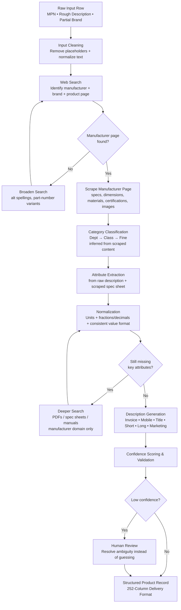
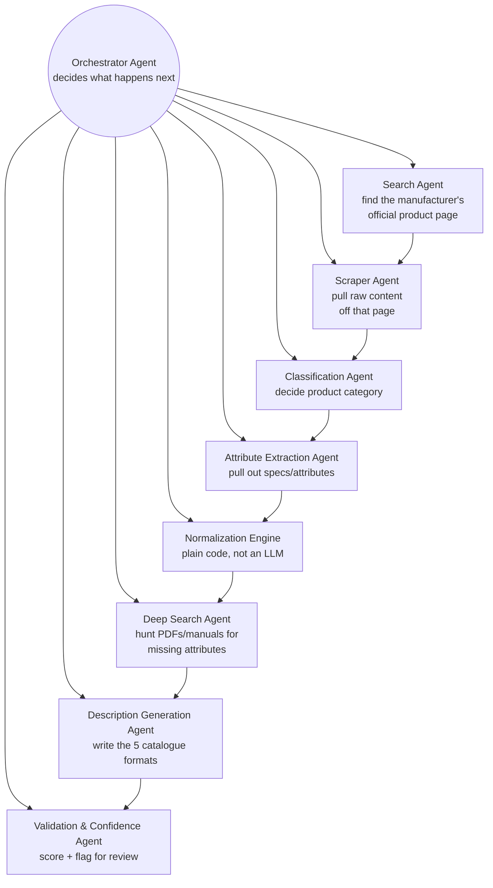
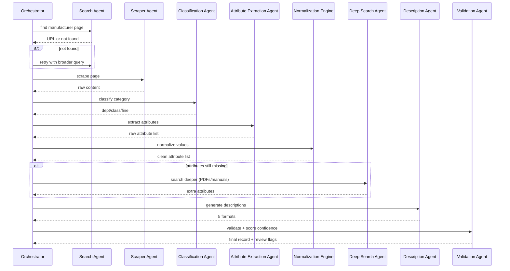

# HyperScaleX
### AI-Powered Product Data Enrichment Pipeline
### Unihack Solution — Team Submission

---

## 1. Problem Statement (as given)

Industrial manufacturers manage vast amounts of product information across websites, catalogs, technical documents, and digital assets. Transforming this fragmented, messy data into accurate, structured, commerce-ready product intelligence is complex and time-consuming.

**Our challenge:** build an AI-powered solution that automates the creation, enrichment, and validation of product intelligence from limited product information — and prove it works against a known-correct ground truth.

---

## 2. An Important Correction to Our Assumption

We originally assumed there'd be a ready-made master catalogue (brand list, taxonomy tree, LOV file) to match input against. **That doesn't exist as a given resource.** So the real job isn't "match messy input to a clean list" — it's **"go find the correct information from scratch, then build the clean record ourselves."**

That's why the pipeline is built around **web search and manufacturer-site scraping** as its core engine, not a fallback.

---

## 3. What HyperScaleX Is

HyperScaleX takes **one raw, messy product row** — often just a part number and a rough description — and turns it into a **complete, standardized, catalogue-ready product record** by searching the web, scraping the manufacturer's real product page, extracting and normalizing the data, and generating the required description formats — flagging anything it can't verify instead of guessing.

To do this reliably, we're not using one big LLM prompt. We're using a small team of **specialized AI agents**, each doing one job and handing off to the next — like an assembly line, where each station is an expert at exactly one thing. This document explains why, then lays out the system design and low-level design for that agent team.

---

## 4. Product Pipeline Flowchart (What Happens To Each Row)



This is the **what** — what happens to the data, step by step. Section 5 below is the **who/how** — which agent does each step, and what it's built with.

---

## 5. Why Multiple Agents (In Simple Words)

If one LLM call tries to search, judge trustworthiness, extract, classify, normalize, and write descriptions all at once, it's too much responsibility for one step — mistakes compound and get harder to catch. So we split it into **specialized agents**, each with one job and its own tools. Benefits:

- Each agent is small and easy to test on its own against the ground truth.
- Mistakes stay contained — a bad classification doesn't quietly corrupt the search step.
- We can swap or improve one agent without touching the others.
- The Orchestrator can retry or branch (search again, dig deeper) without re-running the whole pipeline.

---

## 6. System Design — The Agent Team

### 6.1 High-Level Agent Diagram



**In plain words:** the Orchestrator is the manager — it doesn't do any work itself, it just looks at "where is this row right now" and decides which agent runs next, including sending a row back to Search or Deep Search if something's missing. Every other agent is a specialist that does exactly one job and reports back.

### 6.2 What Each Agent Actually Does

| Agent | Job (one sentence) | Input | Output | Tools It Uses |
|---|---|---|---|---|
| **Orchestrator** | Decide the next step for this row based on what's happened so far | Current row state | Which agent to call next | None — pure logic/routing |
| **Search Agent** | Find the manufacturer's real product page | MPN + description | A candidate URL (or "not found") | Web search tool |
| **Scraper Agent** | Pull raw content off that page | A URL | Raw spec table, text, images, certs | Web fetch/scrape tool |
| **Classification Agent** | Decide the product's category | Scraped content + description | Dept → Class → Fine | LLM reasoning (grounded in scraped text) |
| **Attribute Extraction Agent** | Pull out specific attributes (size, material, voltage...) | Scraped content + description | Structured attribute list | LLM + structured output schema |
| **Normalization Engine** | Fix units, fractions, casing | Raw attribute values | Clean, consistent values | Plain code — no LLM needed |
| **Deep Search Agent** | Hunt for missing data in PDFs/manuals | List of missing attributes + manufacturer domain | Extra attribute values (or still-missing flags) | Web search + PDF-reading tool |
| **Description Generation Agent** | Write the 5 required description formats | Final structured record | Invoice / Mobile / Title / Short / Long / Marketing text | LLM with format rules as constraints |
| **Validation & Confidence Agent** | Score how trustworthy each field is, flag weak ones | Full record | Confidence score per field + review flags | Rule checks + LLM self-check |

### 6.3 Why This Framework: LangGraph

Our pipeline isn't a straight line — it has loops (retry search, deep search) and decisions (found page or not? confidence high or low?). That's exactly what **LangGraph** is built for: it lets you define agents as nodes in a graph, connect them with conditional edges (if/else routing), and it automatically keeps track of the row's state as it moves through the graph. A simpler framework like CrewAI is easier to set up but doesn't handle loops/branches as naturally — and we need those for the retry logic.

---

## 7. Low-Level Design (LLD)

This is the "how it's actually built" layer — data shapes, prompts, and tool contracts for each agent.

### 7.1 Shared Row State (passed between every agent)

```python
class RowState(BaseModel):
    row_id: str
    raw_input: dict                # original MPN, description, brand fields
    manufacturer_url: str | None
    scraped_content: dict | None   # spec_table, text, images, certs
    category: dict | None          # {dept, class, fine}
    attributes: dict               # extracted + normalized attribute values
    missing_attributes: list[str]
    descriptions: dict             # 5 generated formats
    confidence: dict                # per-field confidence score
    needs_review: bool
    status: str                     # tracks which node the row is at
```

This one object is what flows through the whole graph — each agent reads what it needs from it and writes its own piece back in.

### 7.2 Search Agent — LLD
- **Input:** `raw_input.mpn`, `raw_input.description`
- **Tool call:** `web_search(query)` — query built as `"{mpn} {description} manufacturer site"`
- **Logic:** rank results, prefer domains matching a likely manufacturer name over marketplaces (Amazon/eBay/etc. explicitly excluded).
- **Output:** `manufacturer_url` or `null`
- **Retry rule:** if null, Orchestrator reformulates the query (drop noisy words, try MPN-only) and calls again, up to 3 attempts.

### 7.3 Scraper Agent — LLD
- **Input:** `manufacturer_url`
- **Tool call:** `fetch_page(url)` → HTML/text
- **Logic:** parse out spec tables (structured), body text (unstructured), image URLs, certification badges.
- **Output:** `scraped_content` dict, always kept separate from `raw_input` so we always know what came from where (this separation is what makes confidence scoring possible later).

### 7.4 Classification Agent — LLD
- **Input:** `scraped_content.text`, `raw_input.description`
- **Prompt shape:** "Given this product's scraped description, classify it into Department → Class → Fine category. Only use information present in the text below. If unsure, say so."
- **Output schema:** `{dept: str, class: str, fine: str, confidence: float}`
- **Guardrail:** classification must cite which sentence(s) in the scraped content support it — no category assigned without a grounding phrase.

### 7.5 Attribute Extraction Agent — LLD
- **Input:** `scraped_content`, `raw_input.description`
- **Output schema:** list of `{attribute_name, value, unit, source: "scraped_spec_table" | "scraped_text" | "raw_description"}`
- **Priority rule:** structured spec-table values always override free-text-parsed values if both exist for the same attribute.

### 7.6 Normalization Engine — LLD (not an LLM agent)
- **Input:** raw attribute list from 7.5
- **Logic:** plain Python — unit conversion table, fraction↔decimal lookup, casing rules.
- **Output:** same list, cleaned — deterministic, no randomness, so this step is 100% reproducible and doesn't need an LLM call (cheaper, faster, no hallucination risk).

### 7.7 Deep Search Agent — LLD
- **Trigger condition:** `missing_attributes` list is non-empty after normalization.
- **Tool calls:** `web_search(query, site_filter=manufacturer_domain)` targeting PDFs/manuals, then `read_pdf(url)`.
- **Output:** additional attribute values merged back into the row state; anything still missing stays flagged.

### 7.8 Description Generation Agent — LLD
- **Input:** finalized `attributes`, `category`, `raw_input`
- **Prompt shape:** one prompt per format, each with its exact constraint (character limit, structure) passed in explicitly, plus a post-generation length check in code (not trusted to the LLM alone).
- **Output:** `descriptions` dict with all 5 formats.

### 7.9 Validation & Confidence Agent — LLD
- **Input:** full `RowState`
- **Logic per field:** 
  - High confidence: value traced directly to `scraped_content` (structured spec table).
  - Medium confidence: value inferred from unstructured scraped text.
  - Low confidence: value inferred by the LLM with no direct grounding, or field still missing.
- **Output:** `confidence` dict + `needs_review = true` if any required field is low-confidence.

---

## 8. Pipeline Flow — Sequence View



**In plain words:** the Orchestrator calls each agent in turn, waits for its result, and only moves forward once it has what it needs — looping back to Search or Deep Search when something's missing, instead of pushing an incomplete row further down the line.

---

## 9. Tech Stack

| Piece | Choice | Why |
|---|---|---|
| Agent orchestration | **LangGraph** | Handles the loops/branches our pipeline needs (retry search, deep search) |
| LLM | **Claude (Anthropic API)** | Strong instruction-following for grounded extraction + constrained description generation |
| Web search tool | Search API (e.g., Tavily/Serper) | Feeds the Search & Deep Search agents |
| Scraping | `requests` + `BeautifulSoup` / `trafilatura` | Pulls clean text + tables off manufacturer pages |
| PDF reading | `pdfplumber` / `PyMuPDF` | Reads manufacturer spec sheets found in Deep Search |
| Structured output validation | **Pydantic** | Forces every agent's output into a strict schema before it's passed on |
| Data handling | Pandas | Reads input rows, writes final Delivery Format output |
| Demo interface | Streamlit | Run a row through the agent pipeline live, show each agent's output + confidence flags to judges |

---

## 10. Evaluation Plan (What We Show Judges)

- **Field-level accuracy** — compare final output to ground truth, field by field.
- **Source-found rate** — % of rows where the Search Agent located the real manufacturer page.
- **Attribute completeness** — % of expected attributes actually recovered via scrape/deep-search.
- **Agent-level accuracy** — since each agent is independently testable, we can show per-agent accuracy (e.g., "Classification Agent: 91% correct category on the labeled set"), not just an end-to-end number.
- **Character-limit compliance** — % of generated descriptions within their format's limit.

---

## 11. Scope for This Build

- **One fully worked category:** Kitchen & Bath Sink Faucets, so search/scrape/classification behavior can be tuned and validated on a narrow, well-understood product type before generalizing.
- **Full agent pipeline** run on that category, evaluated against the matching ground-truth rows.

---

## 12. Summary

There's no shortcut catalogue to lean on, so HyperScaleX's real job is finding the truth, not just formatting it. We do that with a small team of specialized agents — each one expert at a single step (search, scrape, classify, extract, normalize, write, validate) — coordinated by an Orchestrator that can retry and dig deeper when something's missing, built on LangGraph so those loops are handled properly instead of bolted on. Nothing gets guessed silently; anything the agents can't verify gets flagged for a human to check.
